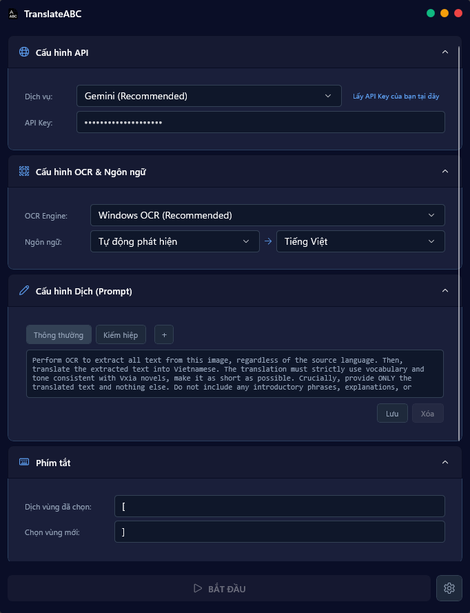

# TranslateABC 🌐

> Ứng dụng dịch văn bản trên màn hình

## ✨ Tính năng

- **Dịch vùng đã chọn** - Chọn bất kỳ vùng nào trên màn hình và dịch ngay lập tức
- **OCR thông minh** - Sử dụng Windows OCR để nhận diện văn bản chính xác
- **Overlay trong suốt** - Hiển thị bản dịch ngay trên vùng văn bản gốc
- **Phím tắt tiện lợi** - Dịch nhanh chóng chỉ với một phím bấm
- **Hỗ trợ đa ngôn ngữ** - Tự động phát hiện và dịch sang tiếng Việt
- **Text-to-Speech** - Đọc bản dịch với giọng nói tự nhiên

## 🚀 Cách sử dụng

1. **Khởi động app** và cấu hình API key (Gemini hoặc OpenAI)
2. **Chọn cửa sổ** cần dịch
3. **Nhấn ]** hoặc click nút "Dịch" để chọn vùng văn bản
4. **Xem bản dịch** hiển thị ngay trên màn hình

## ⚙️ Cài đặt

### Tải về

- **Installer**: Chạy `TranslateABC_Setup.exe` để cài đặt

### Yêu cầu hệ thống
- Windows 10/11 (64-bit)
- .NET 8.0 Runtime

## 🔑 Cấu hình API

### Google Gemini (Khuyến nghị - Miễn phí)
1. Truy cập [Google AI Studio](https://aistudio.google.com/app/apikey)
2. Tạo API key miễn phí
3. Dán vào app và bắt đầu sử dụng

### OpenAI
1. Truy cập [OpenAI Platform](https://platform.openai.com/api-keys)
2. Tạo API key (có phí)
3. Cấu hình trong app

## ⌨️ Phím tắt

| Phím | Chức năng |
|------|-----------|
| **[** | Dịch vùng đã chọn |
| **]** | Chọn vùng mới để dịch |
| **ESC** | Đóng overlay dịch |

## 🎨 Tính năng nổi bật

### OCR chính xác
Sử dụng Windows OCR engine tích hợp sẵn, nhận diện văn bản nhanh và chính xác

## 📝 Giấy phép

MIT License - Sử dụng tự do cho mục đích cá nhân và thương mại

Made with ❤️ for Vietnamese users
